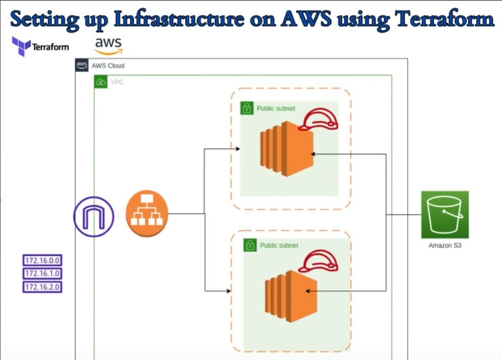
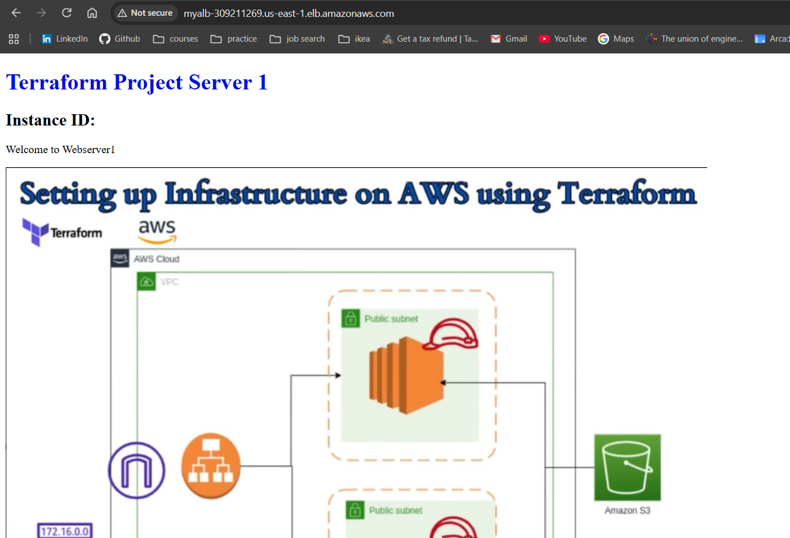
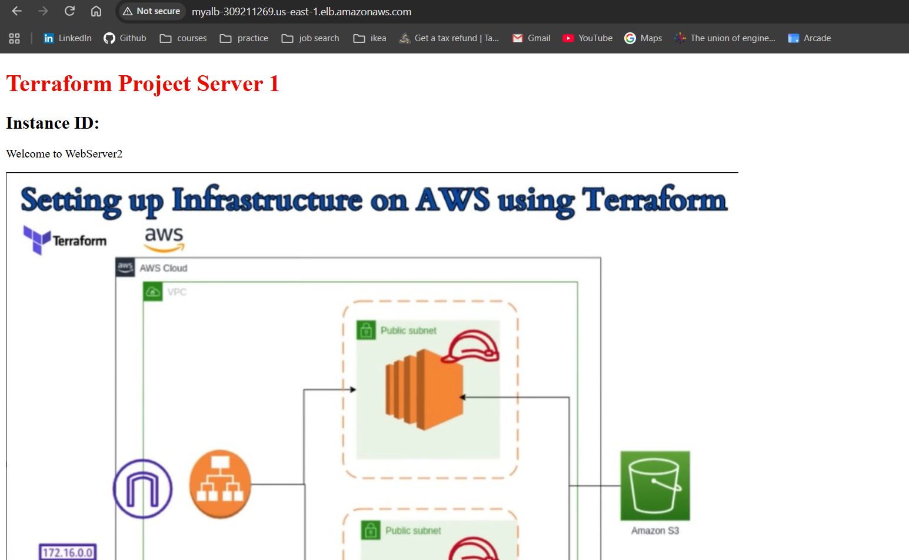

# Terraform AWS Webserver Project

This project uses **Infrastructure as Code (IaC)** via Terraform to automatically deploy a highly available, secure, and load-balanced web hosting environment on Amazon Web Services.

---

## 🏗️ Architecture Overview

This project provisions the following components automatically:
* **Custom AWS VPC:** An isolated network with 2 Public Subnets distributed across separate Availability Zones for high availability.
* **Application Load Balancer (ALB):** Sits at the front door to evenly split incoming web traffic across your servers.
* **Dual EC2 Web Servers:** Two virtual servers running Apache web servers that boot up with a custom "welcome" homepage.
* **Secure S3 Storage Integration:** Private network connectivity to Amazon S3 via a **VPC Gateway Endpoint**, ensuring storage traffic never travels over the public internet.



---

## 🛠️ Prerequisites

Before you start, make sure you have:
1. **Terraform installed** (v1.0 or higher).
2. **AWS CLI installed and configured** with your AWS credentials (`aws configure`).

---

## 🚀 How to Deploy

Follow these simple steps to spin up your entire cloud infrastructure:

### 1. Initialize Project
Download the required AWS plugins and initialize your environment:
```bash
terraform init
```

### 2. View Deployment Plan
Preview the exact AWS resources Terraform is going to create:
```bash
terraform plan
```

### 3. Deploy to AWS
Apply the configuration to launch your live environment. Type `yes` when prompted:
```bash
terraform apply
```

*Once finished, Terraform will output your unique **Application Load Balancer URL**.*

---

## 🔍 Verifying the Deployment

1. Copy the `alb_dns_name` URL provided in the terminal output.
2. Paste it into your web browser.
3. Refresh the page a few times to watch the Application Load Balancer seamlessly switch traffic between `webserver-1` and `webserver-2`.

---

## 🧹 Cleanup & Teardown

To avoid incurring unexpected AWS cloud charges, destroy all infrastructure components completely when you are done:

```bash
terraform destroy
```
*(Type `yes` when prompted to confirm the deletion)*


## Output screenshots




